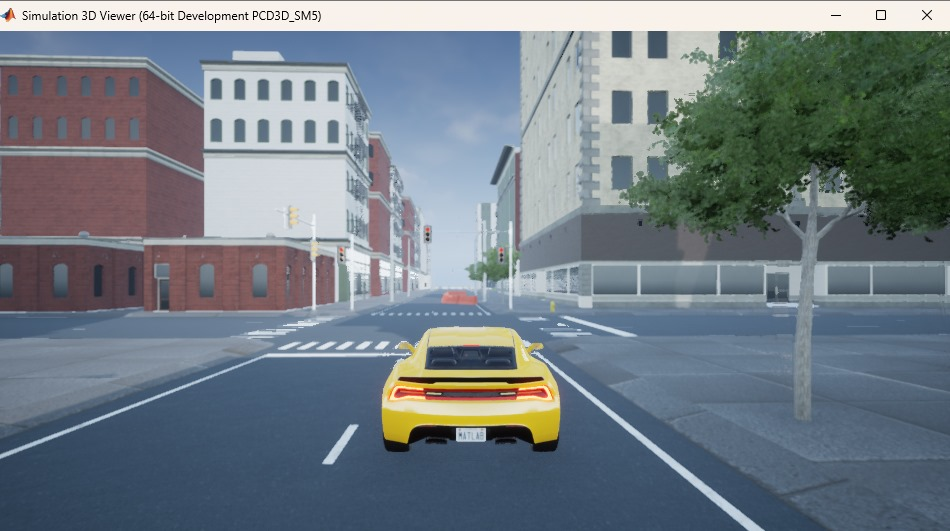
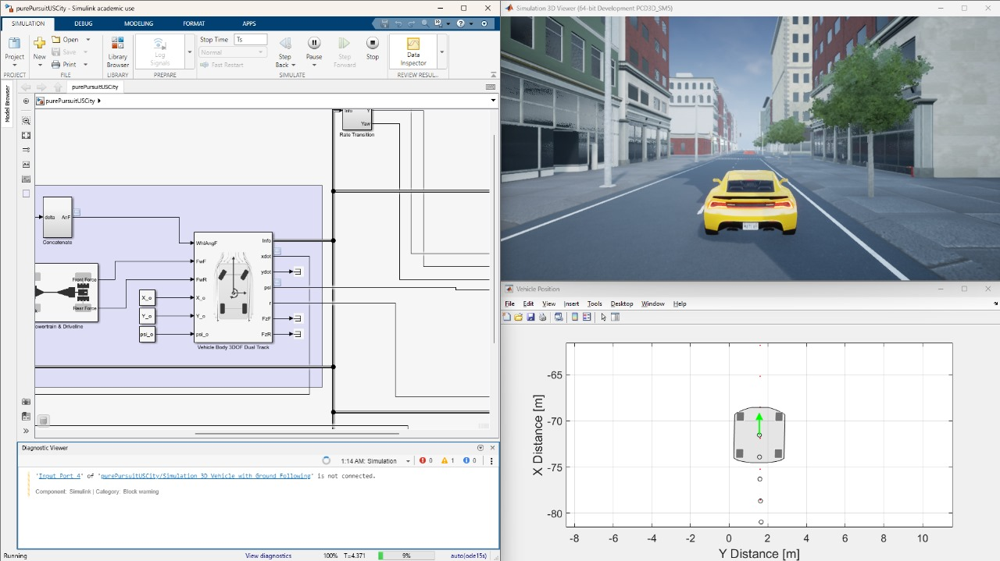
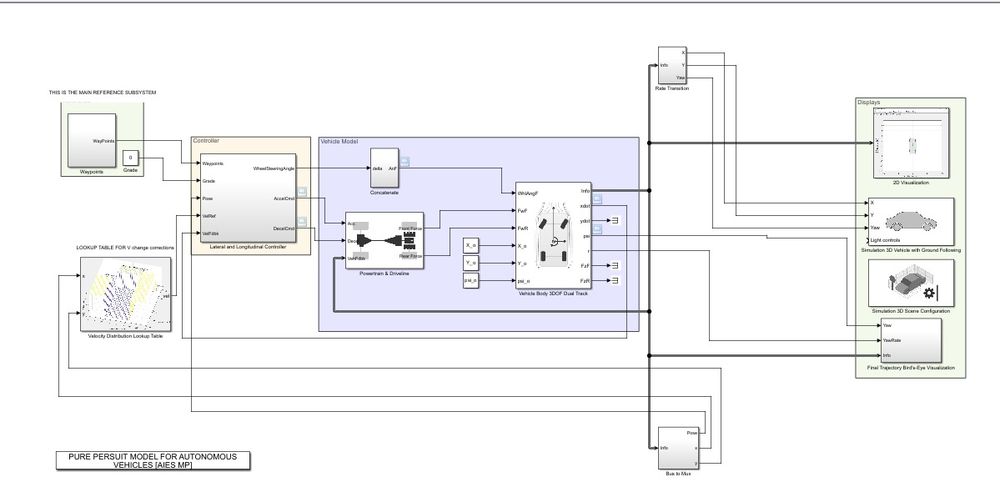

# Project: Tarzan

## YOLO Input-Based Detection System with CAN Bus Integration

### 1. Software

#### 1.1 YOLOv8 Detection

**Goal:**  
Develop an app or service that uses the phone's back camera as an input stream for a YOLO model running on a laptop. For initial implementation, we'll use the IP Webcam to stream the camera feed to the laptop.

- **Reference:**  
  [YOLOv8 Pothole & Obstacle Detection](https://www.youtube.com/watch?v=zgbPj4lSc58&list=PL1u-h-YIOL0sZJsku-vq7cUGbqDEeDK0a)

- **Inputs:**
  - Camera feed streamed via IP Webcam
  - **Frontend:** React

- **Outputs:**
  - **Temporary Output:** Temperature and pressure values for Actuator
  - **Permanent Output:** CAN messages sent to the Panda (placeholder name for now).

---

#### 1.2 CAN Bus Software

##### 1.2.1 CAN Bus Sniffing

- **Objective:** Use **Cabana** to sniff CAN bus data from any car via OBD-II.
  
##### 1.2.2 CAN Bus Messaging

- **Objective:** Use **STM32** to send messages to the car's CAN bus, expecting specific actions based on the messages.

- **Technologies Involved:**
  - **STM32** for CAN message interfacing
  - **Programming Languages:** Rust, C, C++, Python
  

---

#### 1.3 Actuator Usage (Temporary Phase)

- **Objective:** Determine optimal pressure values for the actuator and perform pressure mapping to control the car in a test mode. 

---

### 2. Hardware

#### 2.1 Temporary Setup

- **Objective:** Develop an actuator that follows commands sent via the YOLO outputs . Initially, these commands will be tested superficially in a car for validation purposes, without full integration.

---

#### 2.2 Long-Term Solution

- **Objective:** Develop a custom PCB based on **STM32** for CAN bus communication, which will be 3D-printed and connected to the car's **OBD-II** port.

---

### 3. Simulation Results

Below are the key simulation results showcasing different perspectives of the model . Please keep in mind these are MATLAB results for the pure pursuit approach and are in now way related to the ML models being build as of now :

#### 3.1 Top-Down Pure Pursuit View

#### 3.2 Only Car View in Simulation

#### 3.3 Ongoing Simulation in 3D Environment

#### 3.4 MATLAB System Diagram

---

### 4. Future Work

The project is evolving, and the next steps include the full integration of the actuator and YOLO-based detection with real-time CAN bus messaging and control for autonomous driving applications.

